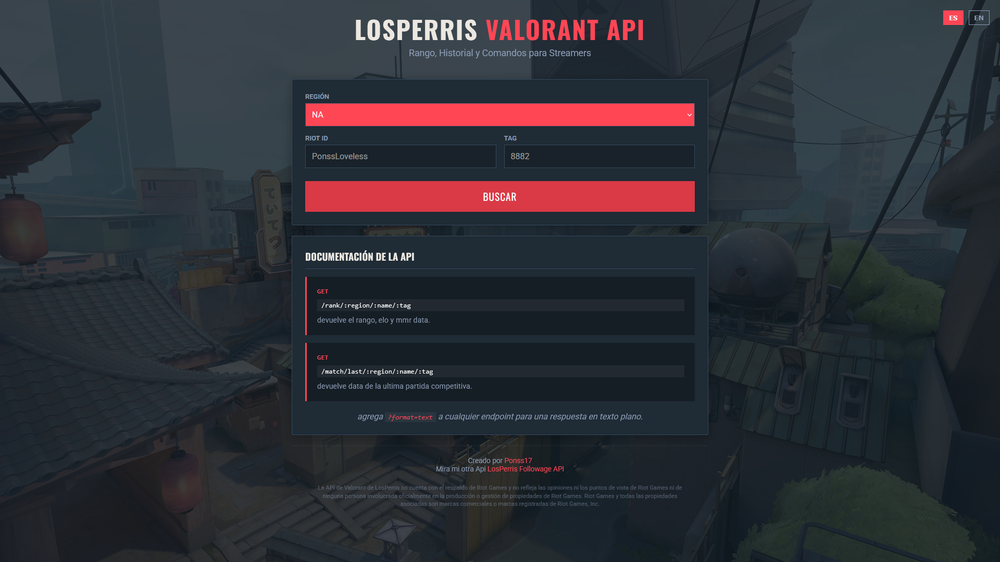
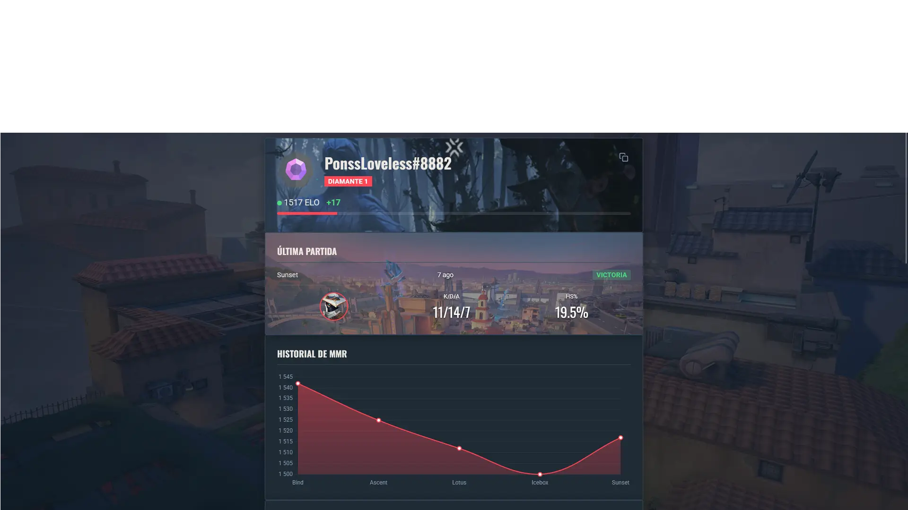
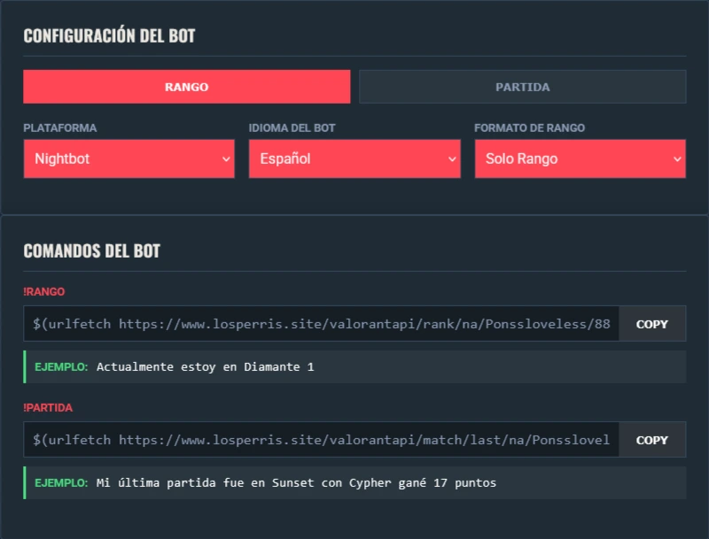
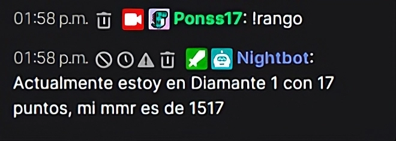
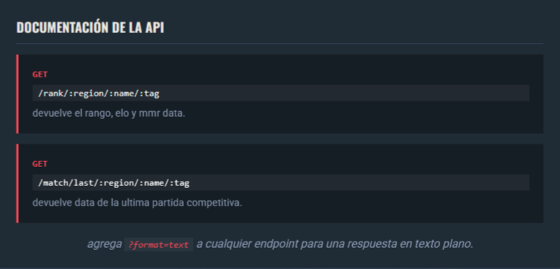

#  LosPerris - Valorant API

> **Hub para comandos de Valorant.**
> Diseñado para streamers, esta herramienta permite generar comandos personalizados para tu chat (Nightbot, StreamElements, Botrix, etc.) sin tocar una sola línea de código.

---

## ✨ Novedades

- **🎨 Diseño Premium**: Nueva interfaz oscura inspirada en la estética de Valorant, con menús en rojo intenso (`#ff4655`) y campos transparentes.
- **🤖 Soporte Botrix**: Ahora compatible con la plataforma Botrix.
- **📱 Móvil Optimizado**: Interfaz 100% responsiva y ajustada para celulares.
- **🌍 Traducción Inteligente**:
    - **Español**: Respuestas naturales ("Actualmente estoy en Diamante 1...").
    - **Inglés**: Formato simplificado ("Diamond 1 - 17RR").
- **📈 Historial de MMR**: Gráfico interactivo para visualizar tu progreso.
- **⚡ Velocidad**: Carga optimizada y búsquedas recientes instantáneas.

---

## 🚀 Cómo Usar (Web)

No necesitas instalar nada. Todo funciona directamente desde la web.

### 1. Busca tu Perfil
Ingresa tu **Riot ID** y **Tag** (ej. `PonssLoveless #8882`) y selecciona tu región.

- **Rango Actual**: ELO y RR traducidos.
- **Última Partida**: Resultado, KDA, HS% y fecha.
- **Gráfico**: Historial de MMR.

### 2. Configura tu Bot
Personaliza la respuesta del bot en la sección **"Configuración del Bot"**:

- **Plataforma**: Nightbot, StreamElements, Botrix, Fossabot, Streamlabs.
- **Idioma**: Español o Inglés.
- **Formato**: Elige qué información mostrar (Solo Rango, con Puntos, con ELO, KDA, HS%, etc.).

### 3. Comandos del Bot
Copia el código generado en la web y pégalo en tu chat.

#### 📝 Ejemplos de Respuesta

**Español (Natural):**
- **!rango**: "Actualmente estoy en Diamante 1 con 50 puntos"
- **!partida**: "Mi última partida fue en Sunset con Cypher gané 17 puntos"

**Inglés (Natural):**
- **!rank**: "Currently I am in Diamond 1 with 50 RR"
- **!lastmatch**: "My last match was on Sunset with Cypher won 17 RR"

---

## 🤖 Plataformas Soportadas

| Plataforma | Comando |
|------------|---------|
| **Nightbot** | `$(urlfetch ...)` |
| **StreamElements** | `${customapi ...}` |
| **Botrix** | `$(urlfetch ...)` |
| **Fossabot** | `$(customapi ...)` |
| **Streamlabs** | `{readapi ...}` |

---

## 🛠️ API Endpoints (Para Desarrolladores)

Si eres desarrollador, puedes usar la API directamente. Añade `?format=text` para respuestas en texto plano.

### Rango
`GET /rank/:region/:name/:tag`
- **Params**: `lang=es|en`, `type=1|2|3`
- **Ejemplo**: `/rank/na/PonssLoveless/8882?format=text&lang=es`

### Última Partida
`GET /match/last/:region/:name/:tag`
- **Params**: `lang=es|en`, `type=1|2|3`
- **Ejemplo**: `/match/last/na/PonssLoveless/8882?format=text&lang=es`

### Historial
`GET /history/:region/:name/:tag`
- Devuelve JSON con el historial de MMR.

---

## © Créditos y Licencia

Creado con ❤️ por **[Ponss17](https://www.instagram.com/ponss_jean/)**.

Mira mi otra API: [LosPerris Followage API](https://www.losperris.site/).

*Disclaimer: LosPerris Valorant Api no está respaldado por Riot Games y no refleja los puntos de vista u opiniones de Riot Games ni de nadie oficialmente involucrado en la producción o gestión de las propiedades de Riot Games. Riot Games y todas las propiedades asociadas son marcas comerciales o marcas registradas de Riot Games, Inc.*
